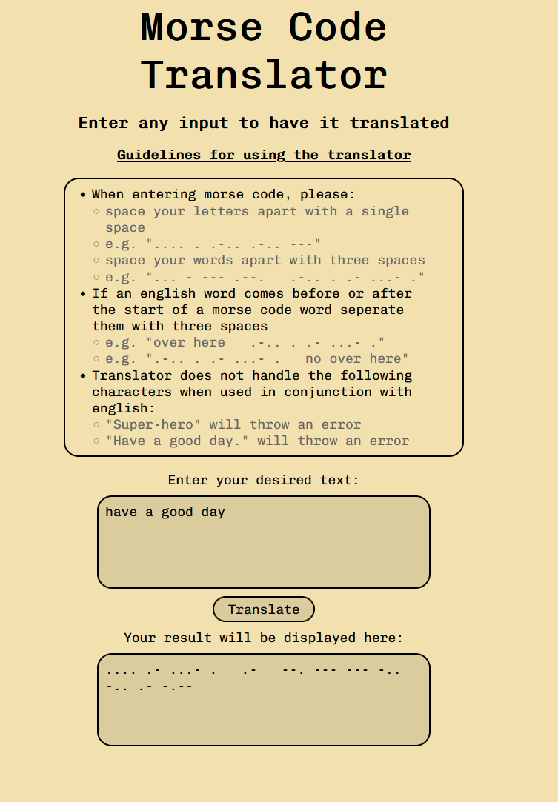

# Morse Code Translator

<!-- {add test badges here, all projects you build from here on out will have tests, therefore you should have github workflow badges at the top of your repositories: [Github Workflow Badges](https://docs.github.com/en/actions/monitoring-and-troubleshooting-workflows/adding-a-workflow-status-badge)} -->

---

## Requirements

### Stack Used

- HTML
- CSS
- JavaScript

### MVP

- Create a user interface that allows the user to either input some English text or some Morse Code
- Create JS functions that would allow the user to:

  - translate their English text into Morse Code
  - Morse Code into English text

- Make sure to handle spaces properly (ie. there is 1 space between English words, but one space between Morse Code characters)

- Bonus: Handle other characters as well
- Bonus: Detect if a piece of text is english or morse and translate accordingly

- Split your code between data, logic functions and dom functions
- Develop unit tests for all of your logic functions
- Explore and discover edge cases in your code to further develop your tests

- purpose of project
- stack used and why

---

## Build Steps

This is a single page application, all you need to do i download the folders and open the index.html into a browser, you by using github click on the environments sections and open deployment

---

## Design Goals / Approach

My goal of this project was to create an intuitive program that had only one input section for the user, to give the user more quality of life features.

I first started off with a TDD approach as I just recently learnt the fundamentals of jest. This helped me immensely as it reduced the amount of times I was using logging everything to find a solution when i could just run the tests to see what I was doing wrong. It also allowed me to document what I needed, prior to actually writing what the function did.

---

## Features

- Singular input allowing the user to input either english, morse code or even both i the so desired
- a comprehensive rule set of what the program is capable of doing

---

## Known issues

#1 ~~Inputing a grammatically correct sentence using periods and dashes will return an error displayed to the user~~ (Fixed)

---

## Future Goals

- ~~To allow for periods and dashes to be used and translated~~
- To implement the mimicMachine.js file that i created into the website itself

---

## Change logs

### Date 12/05/23

Changed the logic to allow for punctually correct sentences (sentences that include periods and dashes), by seperating the morseCodeData object into two and adding more regular expression checks I was able to come to a resolution.

Before i had a regualar expression to see if the whole string itself what either english or morse code, but i came to the realisation that instead of testing for the whole string i just needed to test for the start of the string because that indicates that the user is either inputing english or morse code. Then i only needed to check for spacing in the input and if they followed the correct guidelines, which involved creating a couple more regular expression tests.

---

## What did you struggle with?

What I struggle with the most was the Regular expression I used. RegExp is an extremely powerful tool that can I feel like has a steep learning curve when it comes to looking for complex patterns in strings.

Further research and practise with regular expression would help me for future problems when it comes to working with strings.
